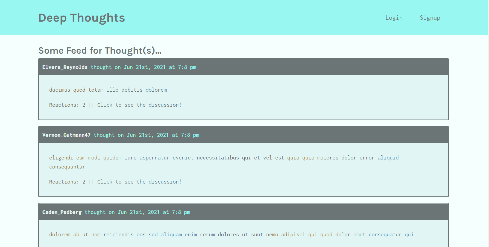
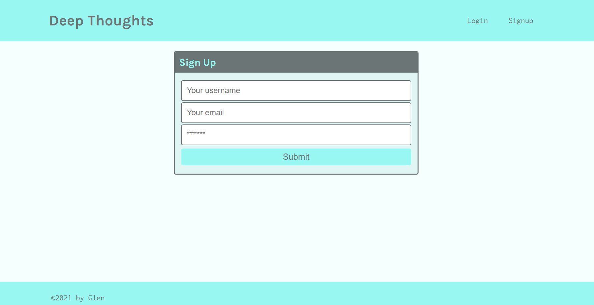
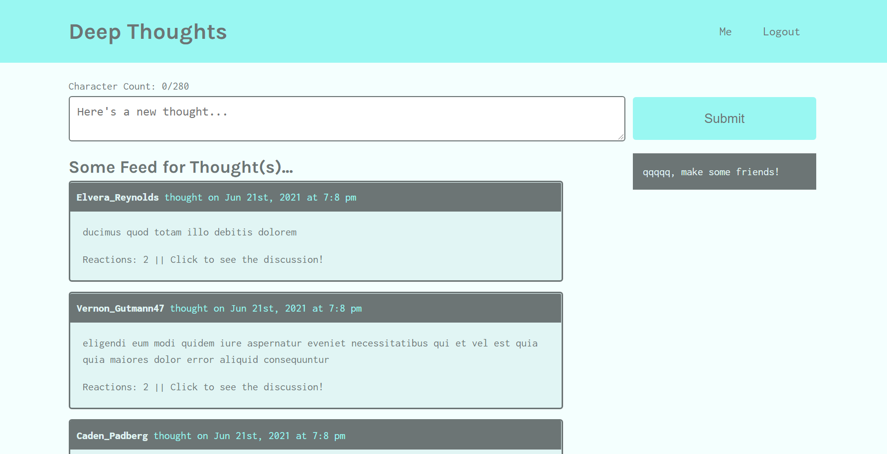
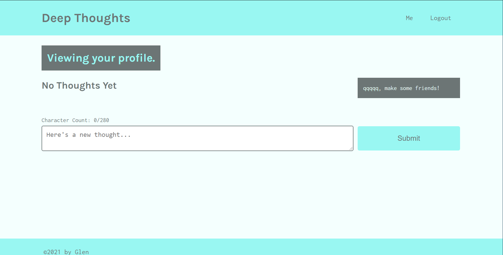

# Deep Thoughts <!-- omit in toc -->

- [Description](#description)
- [Demo](#demo)
- [Technologies Used](#technologies-used)

## Description

Ever had a thought that you just needed to get out there? Deep thoughts is a platform for your big ideas. This easy to use social media web application allows you to connect with other intellectuals, post thoughts, reply to other people's thoughts, and much more! Come join the discourse.

## Demo

A live version of the application can be found [here](https://warm-depths-82390.herokuapp.com/).

On the landing page, users are presented with the option to login or sign up. They can also view any previous posts made by all users in the post feed.

Users can use the appropriate links to either login or sign up.

After logging in or signing up, users will be directed to the main page. The main page will now give users the ability to post thoughts and view their friends.

Logged in users will also be able to visit their dashboard to view their profile. Their profile will include their friends and previous posts, and will also have a space where they can post new thoughts.

## Technologies Used

- MongoDB with Mongoose ODM
- React
- GraphQL with Apollo Client
